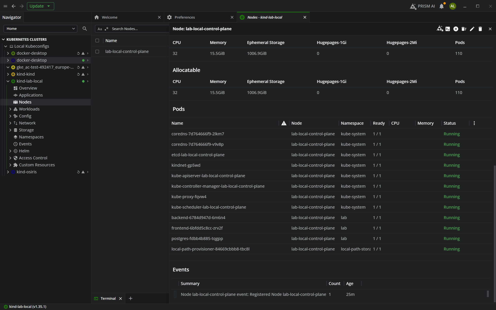

# Raport — Lucrare de laborator: aplicație multi-tier și pipeline CI/CD pe Google Cloud

**Repository:** [CaraAlexandr/AC](https://github.com/CaraAlexandr/AC)  
**Proiect Google Cloud (exemplu):** `ac-test-492417`  
**Data redactării:** aprilie 2026  

---

## 1. Obiectiv

Realizarea unei aplicații formate din **frontend**, **backend** și **bază de date**, containerizate și rulate în **Kubernetes (GKE)** ca **poduri/servicii separate**, cu un **pipeline CI/CD** pe **GitHub Actions** care construiește imagini Docker, le publică în **Google Artifact Registry** și face **deploy** automat în cluster.

Obiectivele aliniate cu laboratorul de **CI/CD pe Google Cloud** au fost:

- familiarizarea cu servicii GCP relevante (Artifact Registry, GKE, IAM, Workload Identity Federation);
- implementarea unui flux **build → push → deploy** declanșat din GitHub;
- utilizarea autentificării **fără cheie JSON** (WIF + OIDC GitHub Actions).

---

## 2. Arhitectura aplicației

| Strat | Tehnologie | Rol |
|-------|------------|-----|
| Frontend | HTML static servit de **nginx** | UI; proxy `/api` către backend în același cluster |
| Backend | **FastAPI** (Python) + **SQLAlchemy** | API REST: `/health`, `/api/items`, persistență |
| Bază de date | **PostgreSQL 16** (imagine oficială) | Stocare relațională; PVC pentru date |

Fluxul utilizatorului:

```text
Browser → Service frontend (LoadBalancer) → Pod nginx
              → /api  →  Service backend  →  Pod FastAPI
                                         →  Service postgres  →  Pod PostgreSQL
```

Manifestele Kubernetes se află în directorul `k8s/` (namespace `lab`), cu **Kustomize** (`kubectl apply -k k8s/`).

---

## 3. Structura repository-ului

| Element | Descriere |
|---------|-----------|
| `backend/` | Cod FastAPI, `Dockerfile`, dependențe `requirements.txt` |
| `frontend/` | Fișiere statice în `public/`, `nginx.conf` (proxy către `backend:8000`), `Dockerfile` |
| `k8s/` | Namespace, Secret DB, Postgres (Deployment + PVC + Service), backend și frontend (Deployment + Service), `kustomization.yaml` |
| `docker-compose.yml` | Rulare locală a celor trei servicii |
| `.github/workflows/deploy-gke.yml` | Pipeline GitHub Actions |
| `cloudbuild.yaml` | Exemplu alternativ de build pe Cloud Build |
| `docs/` | Ghiduri (setup GCP + GitHub, copy-paste, troubleshooting) |

Imaginile folosite în manifeste sunt inițial `lab/backend:latest` și `lab/frontend:latest`; pipeline-ul le înlocuiește prin **`kubectl set image`** cu tag-ul din Artifact Registry (`GITHUB_SHA`).

---

## 4. Pipeline CI/CD (GitHub Actions)

### 4.1 Declanșare

- la **push** pe ramura `main`;
- manual (**workflow_dispatch**).

### 4.2 Pași principali

1. **Checkout** cod.
2. **Autentificare Google** — `google-github-actions/auth@v2` cu **Workload Identity Federation**:
   - secret `WIF_PROVIDER` — numele complet al resursei provider OIDC;
   - secret `WIF_SERVICE_ACCOUNT` — email-ul service account-ului GCP folosit pentru impersonare.
3. **setup-gcloud** — configurare `gcloud` cu `project_id` corect (**Project ID**, nu nume afișat).
4. **Configure Docker** pentru domeniul Artifact Registry (`REGION-docker.pkg.dev`).
5. **Validare variabile** pentru registry (evită tag-uri invalide de tip `...pkg.dev//backend` când lipsește `GCP_PROJECT_ID` sau `AR_REPO`).
6. **Build și push** imagini `backend` și `frontend` către  
   `REGION-docker.pkg.dev/PROJECT_ID/AR_REPO/backend|frontend:SHA` și `:latest`.
7. **Credențiale GKE** — `google-github-actions/get-gke-credentials@v2`.
8. **`kubectl apply -k k8s/`** — aplică manifestele în namespace-ul `lab`.
9. **`kubectl set image`** — actualizează deployment-urile cu imaginile tocmai împinse.
10. **`kubectl rollout status`** — așteaptă finalizarea rulării.

### 4.3 Configurare GitHub (secrets și variabile)

**Secrets (exemple de nume):**

| Secret | Rol |
|--------|-----|
| `WIF_PROVIDER` | Resursa provider WIF (`projects/NUMĂR/.../providers/...`) |
| `WIF_SERVICE_ACCOUNT` | Email service account (ex. `github-actions-gke@PROJECT_ID.iam.gserviceaccount.com`) |

**Variabile sau secrete (același nume acceptat în workflow):**

| Nume | Exemplu |
|------|---------|
| `GCP_PROJECT_ID` | `ac-test-492417` |
| `GCP_REGION` | `europe-west1` (sau regiunea repository-ului Docker) |
| `AR_REPO` | `lab-app` (ID repository Artifact Registry) |
| `GKE_CLUSTER_NAME` | numele clusterului (ex. `lab-cluster` sau `autopilot-cluster-1`) |
| `GKE_LOCATION` | zonă sau regiune (ex. `europe-west1-b`, `europe-west2`) |

Workflow-ul folosește `vars.* || secrets.*` pentru aceste valori, astfel încât pot fi definite fie în **Variables**, fie în **Secrets**.

---

## 5. Configurare Google Cloud (rezumat pași efectuați)

### 5.1 Proiect și API-uri

- Proiect GCP cu **Project ID** (ex. `ac-test-492417`) și **Project number** (ex. `930996767672`) — ambele sunt folosite în contexte diferite.
- API-uri activate: Kubernetes Engine, Artifact Registry, IAM, IAM Credentials, Resource Manager, Service Usage etc.

### 5.2 Artifact Registry

- Repository Docker (ex. **`lab-app`**) într-o **regiune** (ex. `europe-west1`).
- Rol **Artifact Registry Writer** pe service account-ul folosit de pipeline pentru `docker push`.

### 5.3 GKE

- Cluster (Standard sau **Autopilot**), cu nume și locație (`--region` sau `--zone`) folosite în `gcloud container clusters get-credentials` și în variabilele GitHub.

### 5.4 Workload Identity Federation (WIF)

1. **Workload Identity Pool** (ex. `github-pool`, locație `global`).
2. **Provider OIDC** pentru GitHub Actions:
   - Issuer: `https://token.actions.githubusercontent.com`;
   - mapping: `google.subject` → `assertion.sub`, `attribute.repository` → `assertion.repository`;
   - **Attribute condition**: uneori obligatorie în API — folosită expresie de tip `assertion.sub != ""` sau echivalent, conform documentației Google pentru [conditions](https://cloud.google.com/iam/docs/workload-identity-federation-with-deployment-pipelines#conditions).
3. **Service account** dedicat (ex. `github-actions-gke`) cu roluri:
   - `roles/artifactregistry.writer`;
   - `roles/container.developer` (pentru `kubectl` către GKE).
4. **Binding `roles/iam.workloadIdentityUser`** pe service account pentru principalul GitHub:  
   `principalSet://iam.googleapis.com/projects/PROJECT_NUMBER/locations/global/workloadIdentityPools/github-pool/attribute.repository/CaraAlexandr/AC`  
   (ajustat la owner/repo real).

### 5.5 Probleme specifice întâlnite și lecții învățate

| Situație | Cauză / soluție |
|----------|------------------|
| `gcloud config set project` cu **număr** de proiect | `core/project` trebuie setat la **Project ID** (string), nu la project number. |
| Eroare la **Attribute condition** în consolă | Condiția trebuie să refere **claim-uri OIDC** (`assertion.*`), nu `attribute.*`. |
| `ALREADY_EXISTS` la creare provider, dar `list` gol | Provider în stare **`DELETED`** (soft delete); restaurare cu `gcloud iam workload-identity-pools providers undelete`. |
| `invalid_target` la `google-github-actions/auth` | `WIF_PROVIDER` incorect sau provider inexistent; valoarea corectă = **Resource name** din consolă. |
| Tag Docker `...//backend` (slash dublu) | Lipsesc **`GCP_PROJECT_ID`** sau **`AR_REPO`** în GitHub. |
| `setup-gcloud`: project „name” vs ID | Secret/variabilă **`GCP_PROJECT_ID`** trebuie să fie **Project ID**, nu numele afișat al proiectului. |
| `uploadArtifacts` denied | Lipsește **`roles/artifactregistry.writer`** pe SA sau SA greșit. |
| `iam.serviceAccounts.getAccessToken` denied | Lipsește binding **Workload Identity User** între principalul GitHub și service account. |
| `Gaia id not found for email` | **`WIF_SERVICE_ACCOUNT`** greșit, cu spații, sau SA inexistent; aliniere cu emailul din IAM. |

---

## 6. Rulare locală a clusterului Kubernetes cu **kind** și manifestele din `k8s/`

### 6.1 Scop

Pentru dezvoltare și verificare fără costuri în cloud, același set de manifeste Kubernetes din directorul **`k8s/`** poate fi aplicat pe un **cluster local** creat cu [**kind**](https://kind.sigs.k8s.io/) (Kubernetes în Docker). Astfel se validează structura namespace-ului **`lab`**, a Secret-ului pentru PostgreSQL, a deployment-urilor și a serviciilor înainte sau în paralel cu deploy-ul pe GKE.

### 6.2 Ce conține `k8s/` (aceeași sursă ca pentru GKE)

| Fișier / grup | Conținut |
|---------------|----------|
| `namespace.yaml` | Namespace `lab` |
| `postgres.yaml` | `Secret` (`lab-db` cu `POSTGRES_*` și `DATABASE_URL`), `PersistentVolumeClaim`, `Deployment` postgres, `Service` |
| `backend.yaml` | `Deployment` FastAPI, `Service` ClusterIP pe portul 8000 |
| `frontend.yaml` | `Deployment` nginx, `Service` de tip **LoadBalancer** (în cloud primește IP extern; local, pe kind, nu) |
| `kustomization.yaml` | Agregare resurse + namespace implicit pentru `kubectl apply -k k8s/` |

Imaginile referite în manifeste sunt **`lab/backend:latest`** și **`lab/frontend:latest`**. Pe kind, aceste imagini trebuie **construite local** și **încărcate în cluster** (`kind load docker-image`), deoarece registry-ul public nu conține aceste tag-uri.

### 6.3 Scriptul `scripts/local-k8s-kind.sh`

Pentru a automatiza pașii, repository-ul include un script care:

1. Verifică prezența **Docker**, **kind** și **kubectl**.
2. Creează clusterul kind **`lab-local`** dacă nu există (`kind create cluster --name lab-local`), sau refolosește clusterul existent și comută contextul `kubectl` la **`kind-lab-local`**.
3. Construiește imaginile Docker din sursele proiectului:  
   `docker build -t lab/backend:latest ./backend` și `docker build -t lab/frontend:latest ./frontend`.
4. Încarcă imaginile în nodurile kind: **`kind load docker-image …`** pentru ambele tag-uri.
5. Aplică manifestele: **`kubectl apply -k k8s/`** (echivalent semantic cu deploy-ul din pipeline, fără înlocuirea imaginilor din Artifact Registry).
6. Așteaptă **`kubectl rollout status`** pentru deployment-urile `postgres`, `backend`, `frontend` în namespace-ul `lab`.
7. Pornește automat **`kubectl port-forward -n lab svc/frontend 8080:80`**, astfel încât interfața să fie accesibilă la **http://localhost:8080** fără al doilea terminal (oprire cu Ctrl+C). Variabila opțională **`SKIP_PORT_FORWARD=1`** permite doar deploy-ul, fără tunel.

Serviciul `frontend` rămâne de tip LoadBalancer în manifest; pe kind **nu** se alocă automat un IP extern, de aceea **port-forward** este metoda folosită pentru acces local.

### 6.4 Verificare în interfață (Lens) și context `kubeconfig`

După crearea clusterului, **kind** înscrie contextul în fișierul kubeconfig implicit (de obicei **`~/.kube/config`**), sub numele **`kind-lab-local`**. Aplicații precum **Lens** afișează clusterul dacă calea către kubeconfig este aceeași (pe medii **WSL + Windows** trebuie aliniat fișierul din Linux cu cel folosit de Lens pe Windows, vezi documentația din repository).

Figura de mai jos ilustrează clusterul **`kind-lab-local`** deschis în **Lens**: nodul de control (`lab-local-control-plane`), resursele din **`kube-system`**, precum și cele trei poduri ale aplicației în namespace-ul **`lab`** — **backend**, **frontend** și **postgres** — toate în starea **Running** / **Ready**, confirmând că manifestele din `k8s/` rulează corect pe mediul local.



*Fig. 1 — Vizualizare în Lens (The Kubernetes IDE): context **kind-lab-local**, secțiunea nodurilor; în tabel apar podurile aplicației (`lab`) și componentele de sistem.*

### 6.5 Diferențe față de GKE

| Aspect | kind (local) | GKE (cloud) |
|--------|----------------|-------------|
| Imagini aplicație | build local + `kind load` | build în CI + push Artifact Registry + `kubectl set image` |
| Acces UI | `kubectl port-forward` la `svc/frontend` | `LoadBalancer` → **EXTERNAL-IP** |
| Baza de date | același `Secret` și PVC (stocare locală kind) | PVC în cloud; date persistente pe discuri gestionate de GCP |

---

## 7. Acces la clusterul GKE (cloud) și la aplicație

1. Instalare **Google Cloud SDK** și plugin **`gke-gcloud-auth-plugin`** (obligatoriu pentru kubectl cu GKE modern).
2. Autentificare: `gcloud auth login`; `gcloud config set project PROJECT_ID`.
3. Credențiale cluster:  
   `gcloud container clusters get-credentials NUME_CLUSTER --location=LOCATIE --project=PROJECT_ID`
4. Inspectare resurse:  
   `kubectl get pods,svc,deploy -n lab`
5. Adresă frontend:  
   `kubectl get svc -n lab frontend` — coloana **EXTERNAL-IP**; acces browser: `http://EXTERNAL_IP`.

---

## 8. Concluzii

A fost implementată o aplicație **trei straturi** containerizată, deployată pe **GKE** în namespace-ul **`lab`**, cu **PostgreSQL**, **FastAPI** și **nginx** ca servicii separate. Pipeline-ul **GitHub Actions** automatizează **build-ul**, **publicarea în Artifact Registry** și **actualizarea deployment-urilor** în cluster, folosind **Workload Identity Federation** pentru autentificare fără chei JSON pe termen lung.

Parcurgerea practică a inclus configurarea **IAM**, **WIF**, **Artifact Registry** și **GKE**, precum și depanarea erorilor tipice (identificatori proiect, provider OIDC, permisiuni de impersonare și variabile lipsă). A fost validată și rularea **locală** a acelorași manifeste **`k8s/`** pe un cluster **kind**, cu script automatizat și verificare vizuală în **Lens** (context **`kind-lab-local`**). Rezultatul este un flux reproductibil, documentat în repository și potrivit pentru raportarea laboratorului de **CI/CD pe Google Cloud**.

---

*Acest raport sintetizează implementarea și pașii tehnici; detaliile de configurare pot varia ușor în funcție de numele exact al clusterului, regiunii și al repository-ului Artifact Registry folosite în mediul personal.*
